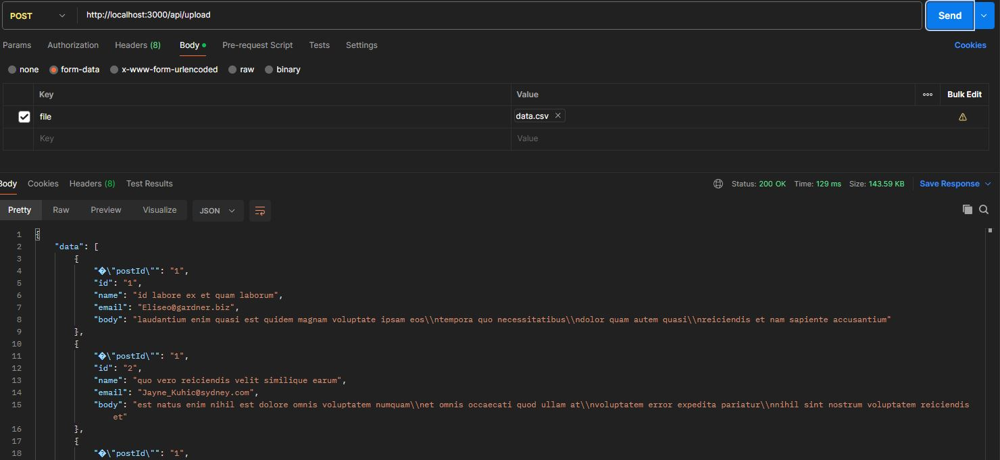
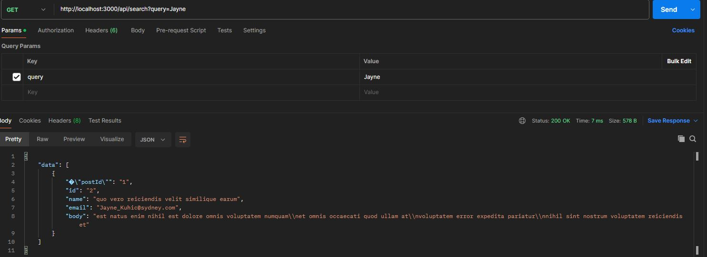

# CSV Upload Project [Backend]

##  Description :
This is the Backend for a CSV Upload Project.

Note that this is the Backend for the following Frontend repository, make sure to clone it to have the full experience.
https://github.com/mryswah/CSVUploadProject-FE

## Features :
- User can upload .csv file
- User can search for a keyword in the .csv file

## Project Setup :
1. Clone this repository :
	```bash
	git clone https://github.com/mryswah/CSVUploadProject-BE.git
	cd CSVUploadProject-BE
	```
2. Install Dependencies :
   <br>**npm install**
   
3. Start the Server :
   <br>**npm start**

5. Server running at :
   <br>**http://localhost:3000**
   
6. Do the same for the Frontend Repository

## Endpoints for Postman : 
| End Points|Screenshot
|----------------------------------------|-------------------------------|
| http://localhost:3000/api/upload       ||
|http://localhost:3000/api/search?query= ||
   
## Testing : 
Execute test: 
<br>**npm run test:ui** 
<br>or
<br>**npm t** (if you do not want to use vitest ui)